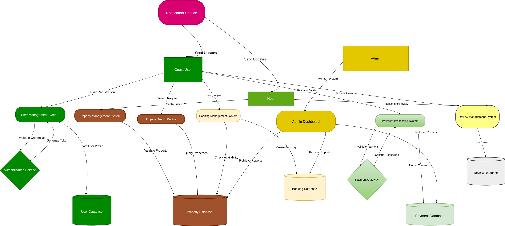

# Airbnb Clone Backend - Data Flow Diagram (DFD)

This document presents the Data Flow Diagram (DFD) for the Airbnb Clone backend system. The DFD visualizes how data moves between users, system processes, and data stores during core operations.

## Objective

To map out the flow of data within the Airbnb Clone system, highlighting how information is processed from input (e.g., user actions) to output (e.g., booking confirmations, payments).

## 📥 Key Entities & Processes

- **External Entities**:

  - Guests
  - Hosts
  - Admin

- **Core Processes**:

  - User Registration & Authentication
  - Property Management (Add/Edit/Delete Listings)
  - Booking Management
  - Payment Processing
  - Review Submission
  - Admin Monitoring

- **Data Stores**:
  - Users
  - Properties
  - Bookings
  - Payments
  - Reviews

## Data Flow Diagram

## File Location

**Repository**: `alx-airbnb-project-documentation`  
**Directory**: `data-flow-diagram/`  
**File**: `data-flow.png`, `README.md`

---

This diagram helps developers understand the data lifecycle within the system and supports the design of efficient, maintainable backend components.

