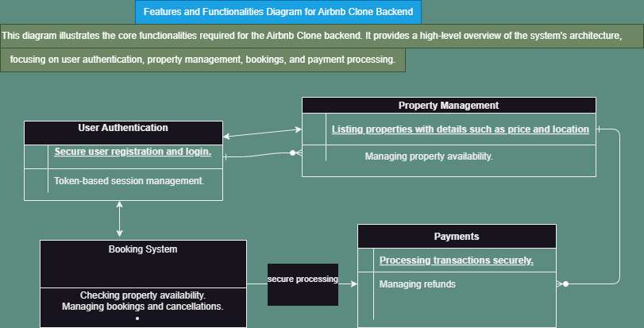

# alx-airbnb-project-documentation

# Airbnb Clone Backend - Features & Functionalities

This document outlines the backend architecture, key features, and technical requirements of the Airbnb Clone project. The backend is designed to support user management, property listings, bookings, payments, reviews, and administrative controls in a secure and scalable way.

## Architecture Diagram

---

## Core Functionalities

### 1. User Management

- **Registration**: Guests and hosts can sign up.
- **Authentication**: Secure login with email/password and OAuth (Google, Facebook).
- **JWT-based sessions** for API access.
- **Profile Management**: Update user information, preferences, and profile photos.

### 2. Property Listings Management

- **Create/Edit/Delete Listings** with title, description, price, amenities, and availability.
- **Image Uploads** stored using cloud storage (S3/Cloudinary).

### 3. Search and Filtering

- **Search** by location, price, number of guests, and amenities.
- **Pagination** support for performance on large datasets.

### 4. Booking Management

- **Create Bookings** with date validation to prevent double bookings.
- **Booking Status**: Pending, confirmed, canceled, completed.
- **Cancellation**: Based on policies set by host or platform.

### 5. Payment Integration

- **Secure Payments** via Stripe/PayPal.
- **Payouts to Hosts** after booking confirmation.
- **Multi-Currency Support**.

### 6. Reviews and Ratings

- **Guest Reviews**: Linked to completed bookings.
- **Host Responses**: Feedback to guest reviews.

### 7. Notifications System

- **Email & In-App Notifications** for bookings, cancellations, payments, etc.
- **Email Services**: Integrated via SendGrid or Mailgun.

### 8. Admin Dashboard

- Monitor and manage:
  - Users
  - Listings
  - Bookings
  - Payments
  - Reviews

---

## Technical Requirements

### 1. Database

- **Relational DB**: PostgreSQL or MySQL
- **Schema Includes**:
  - `Users`
  - `Properties`
  - `Bookings`
  - `Reviews`
  - `Payments`

### 2. API Development

- **RESTful APIs** for CRUD operations.
- Proper use of HTTP methods: GET, POST, PUT/PATCH, DELETE.
- **GraphQL** (optional) for complex queries.

### 3. Authentication & Authorization

- **JWT** for session management.
- **Role-Based Access Control (RBAC)** for guests, hosts, and admins.

### 4. File Storage

- Profile images and property photos handled via local or cloud storage (e.g., AWS S3, Cloudinary).

### 5. Third-Party Integrations

- **Payment**: Stripe/PayPal
- **Email**: SendGrid or Mailgun
- **File Storage**: S3/Cloudinary

### 6. Error Handling & Logging

- Centralized and global error handling for all API routes.
- Log API usage and errors for debugging and auditing.

---

## Non-Functional Requirements

### 1. Scalability

- Modular microservice-ready architecture.
- Load balancing for horizontal scaling.

### 2. Security

- Encrypted sensitive data.
- Input validation, rate limiting, and firewall policies.

### 3. Performance Optimization

- **Redis caching** for frequent data (e.g., search results).
- Optimized SQL queries for faster data access.

### 4. Testing

- **Unit Tests** using `pytest`.
- **Integration Tests** for API validation and flows.
- Automated CI tools recommended.

---

## File Location

This file is located in the `features-and-functionalities/` directory of the GitHub repository:

**Repository**: [alx-airbnb-project-documentation](https://github.com/YOUR-USERNAME/alx-airbnb-project-documentation)

**Directory**: `features-and-functionalities/`  
**Files**:

- `README.md`
- `features-and-functionalities.png`

---
