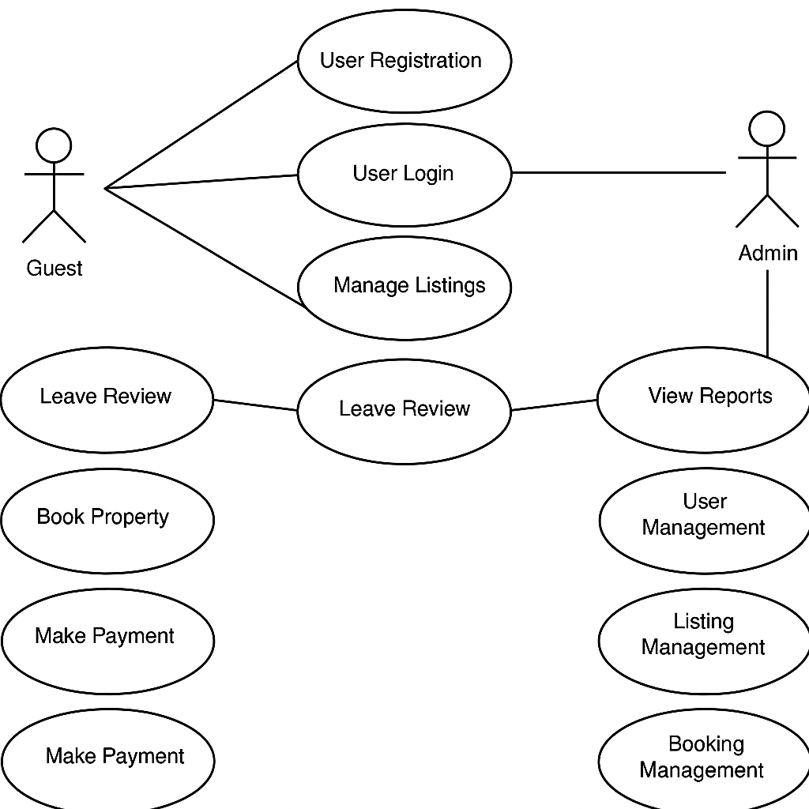

# Airbnb Clone Backend - Use Case Diagram

This document provides a use case diagram that visualizes the main system interactions between users (Guest, Host, and Admin) and the Airbnb Clone backend system.

## Objective

To clearly represent how different user roles interact with core backend functionalities such as registration, property listing, booking, payments, and administrative tasks.

## Actors

- **Guest**: A user looking to book properties and leave reviews.
- **Host**: A user listing properties and managing bookings.
- **Admin**: A user managing the system backend, users, and reports.

## Use Cases

- User Registration & Login
- Property Listing Management
- Booking Properties
- Making Payments
- Leaving Reviews
- Admin Management (Users, Listings, Bookings, Reports)

## Use Case Diagram

## File Location

**Repository**: `alx-airbnb-project-documentation`  
**Directory**: `use-case-diagram/`  
**Files**:

- `README.md`
- `airbnb-use-case-diagram.png`

---

This diagram helps developers and stakeholders understand the interaction flow between actors and system features.
